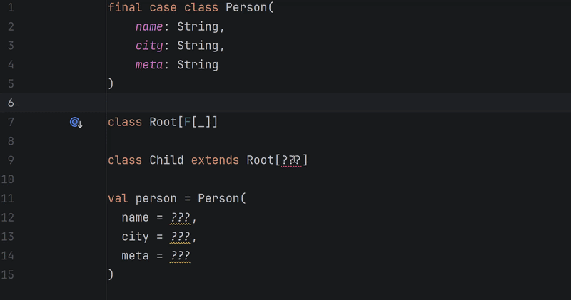
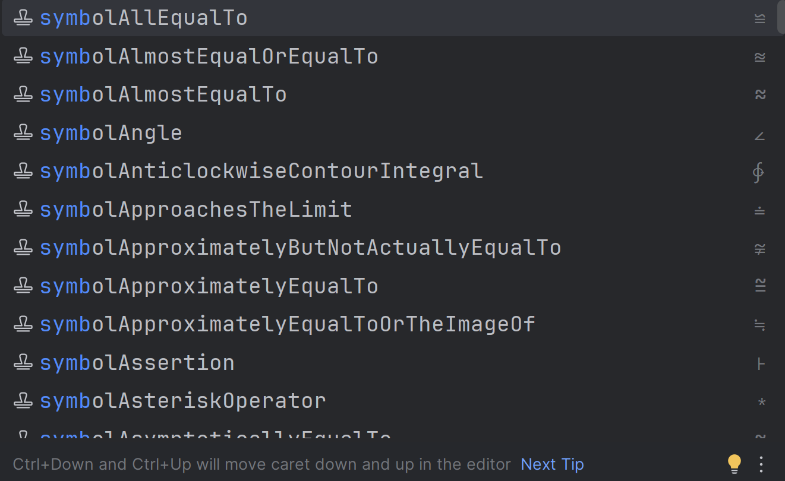
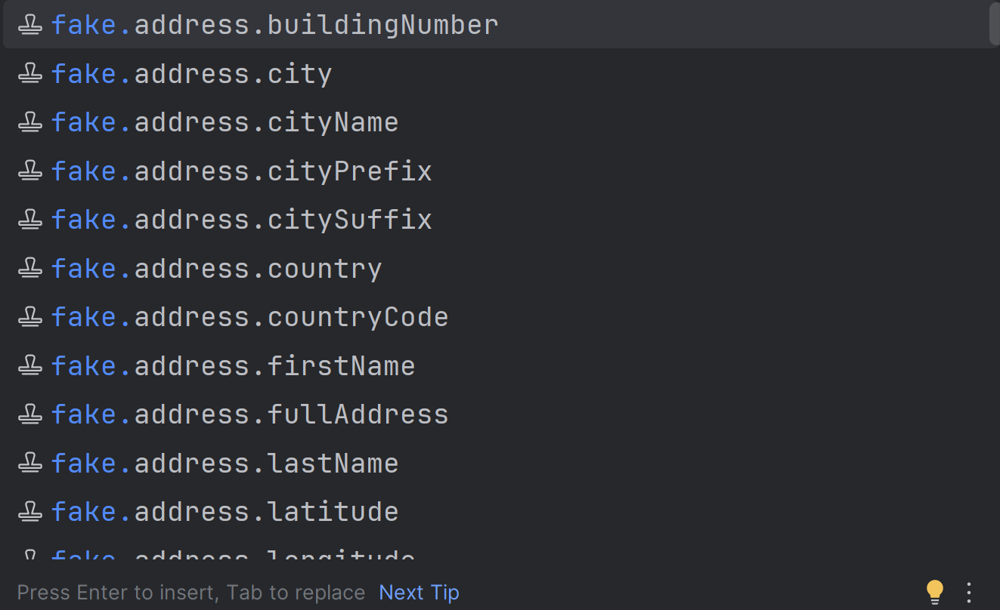
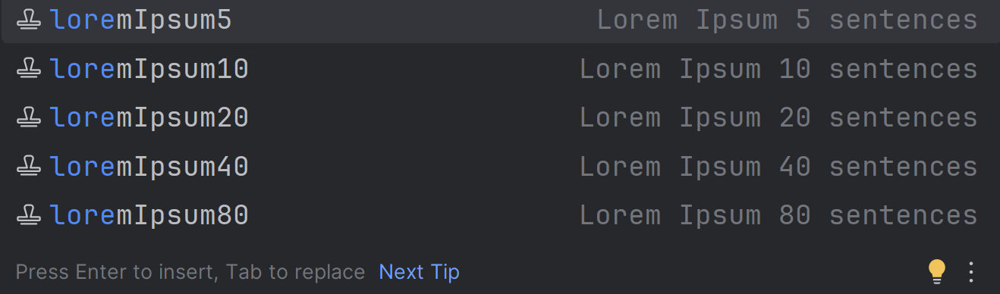

# Spec &amp; Math symbols

[](https://plugins.jetbrains.com/plugin/14267-spec-and-math-symbols)
[](https://plugins.jetbrains.com/plugin/14267-spec-and-math-symbols)
[](https://github.com/g4l9/symbol-idea-plugin/issues)
[](https://github.com/g4l9/symbol-idea-plugin/issues)
[](https://gitpod.io/#https://github.com/g4l9/symbol-idea-plugin)


<div align="center">
  
</div>

## Usage

<div align="center">
  
</div>

## Plugin features

Inject symbols

You can find all available auto-complete symbols in the [table](SYMBOLS.md)

<div align="center">
    
</div>

Inject random value

<div align="center">
    
</div>

Inject lorem ipsum

<div align="center">
    
</div>

## Build

### Build zip plugin

```bash
./gradlew buildPlugin
```

Windows

```bash
.\gradlew.bat buildPlugin
```

### Run plugin in debug mode

Linux/MacOS

```bash
./gradlew runIde --debug-jvm
```

Windows

```bash
.\gradlew.bat runIde --debug-jvm
```